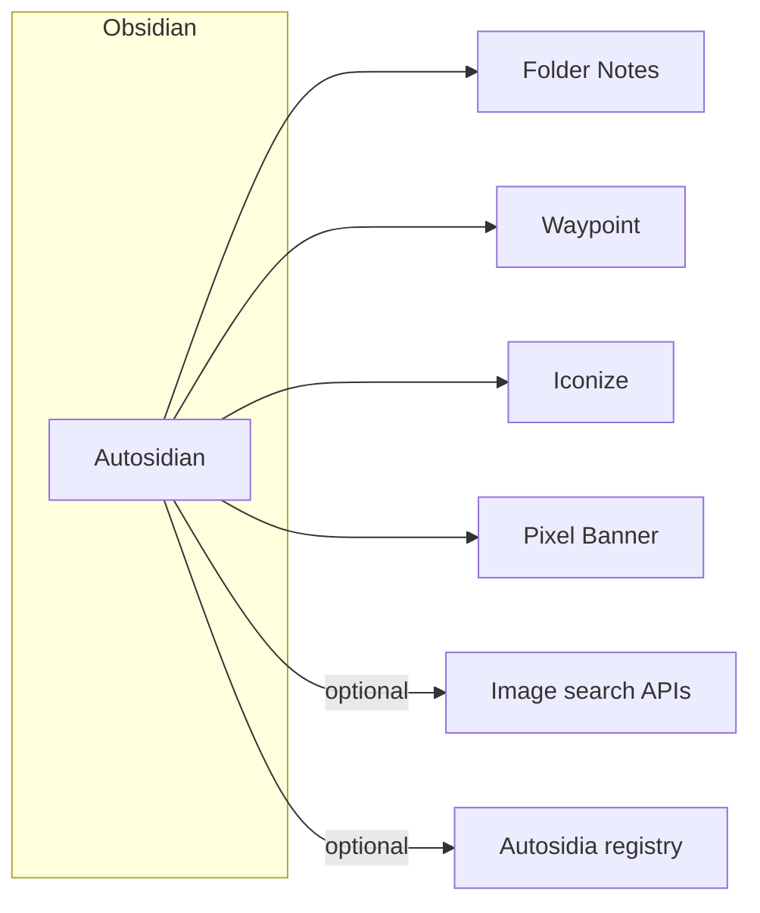

# Architecture

**Autosidian** is an Obsidian community plugin (TypeScript) that composes with other community plugins. **Autosidia** is a separate web application for preset sharing; it is not embedded in the Obsidian binary.

## High-level diagram

## Module boundaries (logical)

- **Settings / data store** — Persists per-vault (or per-device, per Obsidian rules) options: toggles, rate limits, keyword sets, and paths. Uses `loadData` / `saveData` or equivalent.
- **Folder note automation** — Listens to vault events (folder created, file created, rename). Invokes Folder Notes–compatible file operations.
- **Waypoint automation** — Parses note content for Waypoint tokens; idempotent insert when `%% Begin Waypoint %%` is absent and folder has children.
- **Iconize automation** — Resolves icon from keyword list; calls Iconize’s public surfaces (or file metadata) as supported by the Iconize version.
- **Pixel Banner automation** — Triggers image search, writes front matter or Pixel Banner’s expected fields per that plugin’s version.
- **Autosidia client (optional)** — HTTP client for import/export and publish; may be feature-flagged until the service exists.

## Dependency rules

- **Do not** fork or copy the other plugins; depend on them being installed and use their **documented** extension points, commands, and file layout.
- On missing dependency: soft-fail with settings notice, not a crash loop.

## Data entities (conceptual)

- **Settings schema** — Versioned JSON blob for all toggles and rate limits.
- **Keyword set** — Named list of `{ keyword, emoji }` or similar; import/export for Autosidia.
- **Preset bundle** — Optional aggregate export (settings subset + keyword sets) for sharing.

See [API.md](API.md) for external interfaces.
