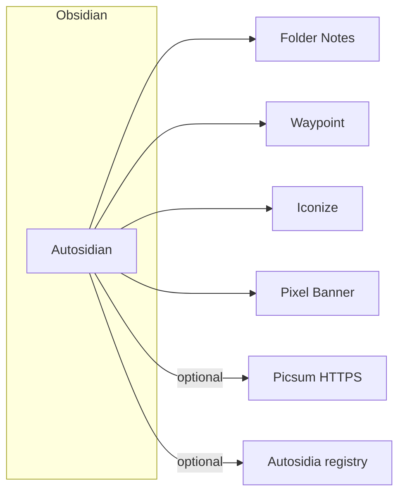

# Architecture

**Autosidian** is an Obsidian community plugin (TypeScript) that composes with other community plugins. **Autosidia** is a separate web application for preset sharing; it is not embedded in the Obsidian binary.

## High-level diagram

## Source layout (repository)

- `src/main.ts` — `Plugin` entry: settings, tab, and `register*Feature` for folder notes, waypoint, iconize, pixel banner; per-feature retro queue instances.
- `src/migrateSettings.ts` — merge persisted JSON with `DEFAULT_SETTINGS` (`settingsVersion` **3**).
- `src/safePath.ts` — `isUnderObsidianConfig` (ignore `.obsidian/` paths).
- `src/settings.ts` — `folderNotes`, `waypoint`, `iconize`, `pixelBanner`, `autosidia` (`registryBaseUrl`).
- `src/deps/requiredPlugins.ts` — required community plugin IDs and `getMissingRequiredPlugins()`.
- `src/folderNotes/` — Auto–Folder Notes.
- `src/waypoint/` — Auto–Waypoint (markdown helpers, register, `retroactiveWaypointQueue.ts`).
- `src/iconize/` — keyword match, `processFrontMatter` for `icon` on folder notes, register, retro.
- `src/pixelBanner/` — Picsum seed URLs, `processFrontMatter` for `banner`, modal, register, retro.
- `src/presets/` — JSON export / import. `src/autosidia/` — optional health check (`GET {base}/health`).
- `src/ui/AutosidianSettingTab.ts` + `moreSettings.ts` — **Settings → Autosidian** UI.
- `src/**/*.test.ts` — [Vitest](vitest.config.ts) (excluded from plugin `tsc` in [tsconfig](tsconfig.json)).
- `styles.css` — settings styling; Obsidian loads it from the plugin folder.
- `esbuild.config.mjs` — bundle `src/main.ts` to root `main.js` (see `npm run build`).

## Module boundaries (logical)

- **Settings / data store** — Persists per-vault (or per-device, per Obsidian rules) options: toggles, rate limits, keyword sets, and paths. Uses `loadData` / `saveData` or equivalent.
- **Folder note automation** — Listens to vault events (folder created, file created, rename). Invokes Folder Notes–compatible file operations.
- **Waypoint automation** — Inserts `%% Waypoint %%` when the folder has subfolders and the folder note is missing a waypoint; idempotent.
- **Iconize automation** — Longest keyword match; writes `icon` in front matter (Iconize must read the same key / front matter on).
- **Pixel Banner automation** — Sets `banner` (or configured field) to a Picsum URL or opens a small picker; respects rate limits in retro.
- **Autosidia client (optional)** — `GET` health to `registryBaseUrl` when set; no auth in the stub.

## Dependency rules

- **Do not** fork or copy the other plugins; depend on them being installed and use their **documented** extension points, commands, and file layout.
- On missing dependency: soft-fail with settings notice, not a crash loop.

## Data entities (conceptual)

- **Settings schema** — Versioned JSON blob for all toggles and rate limits.
- **Keyword set** — Named list of `{ keyword, emoji }` or similar; import/export for Autosidia.
- **Preset bundle** — Optional aggregate export (settings subset + keyword sets) for sharing.

See [API.md](API.md) for external interfaces.
